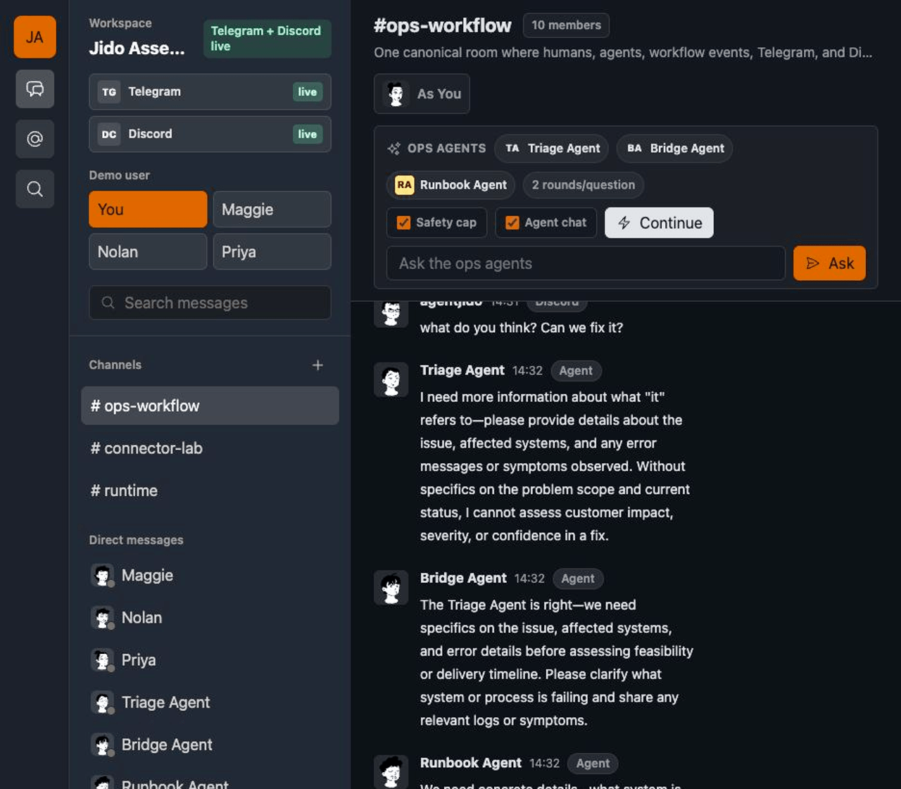

# Jido Assembly

`jido_assembly` is the Jido Chat showcase app: agent-native team chat plus a
bridge console, presented with familiar Slack-like chat primitives. It uses
Hologram as the UI layer, Phoenix as the web shell, `jido_messaging` for durable
chat primitives and bridge routing, SQLite for local persistence, Jido
Signal-style events for UI updates, Phoenix Presence for online state,
`jido_chat` adapters for optional Telegram and Discord connectors, and `jido_ai`
for bounded AI participants in chat.

The package module prefix is `Jido.Assembly`.



## What This Demonstrates

- A responsive Slack-like shell with workspace rail, channels, DMs, timeline,
  composer, reactions, threads, mentions, search, and mobile room switching.
- A seeded `#ops-workflow` room that drops directly into a realistic incident
  flow with humans, narrative agents, provider-shaped messages, and a workflow
  approval card.
- Durable rooms, participants, messages, reactions, and thread replies through
  `jido_messaging` and SQLite.
- Hologram realtime broadcasts carrying compact `jido.messaging.*` signal
  metadata after durable writes commit.
- Optional live Telegram and Discord bridge setup using `jido_messaging`
  `BridgeConfig`, `RoomBinding`, and `RoutingPolicy` records. Without
  credentials, seeded demo traffic keeps the app usable.
- Three seeded ops agents, Triage Agent, Bridge Agent, and Runbook Agent, that
  can run a safety-capped agent round when `ANTHROPIC_API_KEY` is present.
- A thin Phoenix web layer: Phoenix hosts Hologram, health checks, static
  assets, and Presence integration while the chat behavior lives in the app
  context.
- A developer inspector that shows how Hologram, `jido_messaging`, Jido Signal,
  SQLite, `jido_chat`, adapters, bridge delivery metadata, and Assembly
  responsibilities fit together for the active room.

## Run

```sh
mix setup
mix holo
```

Then open [`localhost:4000`](http://localhost:4000).

Use `mix holo` instead of `mix phx.server` when working on Hologram pages. In
dev and test, Hologram only starts when `HOLOGRAM_START=1`, which `mix holo`
sets for you.

If another local app is already using port 4000:

```sh
PORT=4002 mix holo
```

Assembly stores local demo state in `data/jido_assembly.sqlite3`. Delete that
file if you want to reset the demo workspace.

The default app works without connector credentials. To enable live connector
routing, set any supported connector pair before starting the server:

```sh
cp .env.example .env
# edit .env and set optional Telegram or Discord values
# DISCORD_PUBLIC_KEY is only needed for Discord webhook flows
mix holo
```

Local messages in `#ops-workflow` are persisted first, then broadcast to every
configured live bridge. Inbound Telegram and Discord messages bind back to the
same canonical ops room through `jido_messaging`.

To try live AI agent actions, add an Anthropic key before starting the server:

```sh
cp .env.example .env
# edit .env and set ANTHROPIC_API_KEY
mix holo
```

Open the default `#ops-workflow` room, keep `Safety cap` enabled, type a
question in the ops agent prompt, and click `Ask`. Each human prompt can be
continued for two agent rounds; ask a new question to restart the discussion.
Without `ANTHROPIC_API_KEY`, only live agent actions are disabled.

## Dependency Note

Assembly temporarily depends on the `jido_messaging` `main` branch because the
SQLite and signal APIs from
[agentjido/jido_messaging#24](https://github.com/agentjido/jido_messaging/pull/24)
are merged but not yet released to Hex. After a new Hex release ships, switch
`mix.exs` back to the released package.

## Code Shape

- `app/` contains Hologram pages, components, reducers, and server command
  handlers.
- `lib/jido_assembly/` contains the Assembly backend context, bridge setup,
  read projections, mentions, seeds, messaging integration, Presence adapter
  configuration, Jido AI agent orchestration, and developer inspector data.
- `lib/jido_assembly_web/` stays thin: endpoint, router, Phoenix Presence,
  Hologram presence notifier, and signal presentation for the UI.
- `jido_messaging` owns reusable messaging primitives, bridge configs, room
  bindings, routing policies, and the SQLite adapter. Assembly owns the
  Slack-like product choices and demo read models.

## Testing Story

Assembly now has Hologram-focused ExUnit coverage in
`test/jido_assembly/pages/assembly_page_test.exs`. These tests exercise the
parts of Hologram that are most testable today: page `init/3`, template
evaluation, client `action/3` state transitions, server `command/3` handling,
and queued Hologram broadcasts.

The local suite also checks the Assembly chat context, mentions, Presence
adapter, connector setup, signal presenter, and wiring to the upstream
`Jido.Messaging.Persistence.SQLite` adapter. Adapter-level durability tests
belong in `jido_messaging`; Assembly should prove that the demo uses those
primitives cleanly rather than duplicating low-level persistence coverage.

Compared with Phoenix LiveView testing, this is lower-level. Hologram actions
and commands are easy to unit test because they return `%Hologram.Component{}`
and `%Hologram.Server{}` structs, but Hologram does not currently provide a
LiveViewTest-style DOM/event DSL for full in-process interaction tests.

Compared with Playwright, these tests are faster and more deterministic, but
they do not prove browser behavior, CSS/layout, JavaScript interop, SSE
delivery, or cross-tab realtime updates. Keep Playwright for the end-to-end
checks that matter to a chat product: two browser sessions, realtime sends,
room creation propagation, mobile layout, focus/keyboard behavior, and visual
overflow.

`Hologram.Test.setup/0` exists for browser/feature tests, but in this app it
needs the Assembly Hologram patch/prune path because `jido_messaging` pulls in
server-only transitive BEAM modules that Hologram `0.9.1` tries to reflect over.
That makes the current feature-test story workable, but not as mature as
Phoenix LiveView's built-in test ergonomics.

## Hologram Note

`jido_messaging` currently pulls in a transitive Erlang dependency with BEAM
debug info that Hologram `0.9.1` cannot reflect over. `mix setup` applies a
narrow local patch to `deps/hologram/lib/hologram/reflection.ex` so unsupported
BEAM debug info is skipped instead of crashing the Hologram compiler.

## Intentional Non-Goals

- Full Slack API compatibility
- Production authentication, authorization, billing, or compliance controls
- File uploads, huddles, workflows, apps, Canvas, Lists, or enterprise admin
- Full connector administration UI beyond the small status surface and
  developer inspector

See `ROADMAP.md` for a fuller product and platform roadmap against Slack-like
alternatives.
