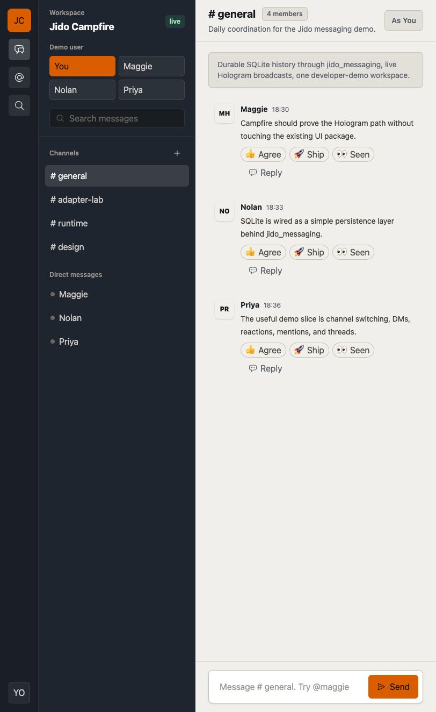

# Jido Campfire

`jido_campfire` is a developer-level spike for a small Slack-like Jido
workspace. It uses Hologram as the UI layer, Phoenix as the web shell,
`jido_messaging` for durable chat primitives, SQLite for local persistence,
Jido Signal-style events for UI updates, and Phoenix Presence for online
state.

The package module prefix is `Jido.Campfire`.



## What This Demonstrates

- A responsive Slack-like shell with workspace rail, channels, DMs, timeline,
  composer, reactions, threads, mentions, search, and mobile room switching.
- One seeded workspace that is useful for 5-10 local demo users without adding
  production authentication.
- Durable rooms, participants, messages, reactions, and thread replies through
  `jido_messaging` and SQLite.
- Hologram realtime broadcasts carrying compact `jido.messaging.*` signal
  metadata after durable writes commit.
- A thin Phoenix web layer: Phoenix hosts Hologram, health checks, static
  assets, and Presence integration while the chat behavior lives in the app
  context.
- A developer inspector that shows how Hologram, `jido_messaging`, Jido Signal,
  SQLite, `jido_chat`, and Campfire responsibilities fit together for the
  active room.

## Run

```sh
mix setup
mix holo
```

Then open [`localhost:4000`](http://localhost:4000).

Use `mix holo` instead of `mix phx.server` when working on Hologram pages. In
dev and test, Hologram only starts when `HOLOGRAM_START=1`, which `mix holo`
sets for you.

If another local app is already using port 4000:

```sh
PORT=4002 mix holo
```

Campfire stores local demo state in `data/jido_campfire.sqlite3`. Delete that
file if you want to reset the demo workspace.

## Dependency Note

Campfire temporarily depends on the `jido_messaging` PR branch that adds the
SQLite and signal APIs used by this demo. After
[agentjido/jido_messaging#24](https://github.com/agentjido/jido_messaging/pull/24)
lands and ships to Hex, switch `mix.exs` back to the released package.

## Code Shape

- `app/` contains Hologram pages, components, reducers, and server command
  handlers.
- `lib/jido_campfire/` contains the Campfire backend context, read projections,
  mentions, seeds, messaging integration, Presence adapter configuration, and
  developer inspector data.
- `lib/jido_campfire_web/` stays thin: endpoint, router, Phoenix Presence,
  Hologram presence notifier, and signal presentation for the UI.
- `jido_messaging` owns the reusable messaging primitives and SQLite adapter;
  Campfire owns the Slack-like product choices and demo read models.

## Testing Story

Campfire now has Hologram-focused ExUnit coverage in
`test/jido_campfire/pages/campfire_page_test.exs`. These tests exercise the
parts of Hologram that are most testable today: page `init/3`, template
evaluation, client `action/3` state transitions, server `command/3` handling,
and queued Hologram broadcasts.

The local suite also checks the Campfire chat context, mentions, Presence
adapter, signal presenter, and wiring to the upstream
`Jido.Messaging.Persistence.SQLite` adapter. Adapter-level durability tests
belong in `jido_messaging`; Campfire should prove that the demo uses those
primitives cleanly rather than duplicating low-level persistence coverage.

Compared with Phoenix LiveView testing, this is lower-level. Hologram actions
and commands are easy to unit test because they return `%Hologram.Component{}`
and `%Hologram.Server{}` structs, but Hologram does not currently provide a
LiveViewTest-style DOM/event DSL for full in-process interaction tests.

Compared with Playwright, these tests are faster and more deterministic, but
they do not prove browser behavior, CSS/layout, JavaScript interop, SSE
delivery, or cross-tab realtime updates. Keep Playwright for the end-to-end
checks that matter to a chat product: two browser sessions, realtime sends,
room creation propagation, mobile layout, focus/keyboard behavior, and visual
overflow.

`Hologram.Test.setup/0` exists for browser/feature tests, but in this app it
needs the Campfire Hologram patch/prune path because `jido_messaging` pulls in
server-only transitive BEAM modules that Hologram `0.9.1` tries to reflect over.
That makes the current feature-test story workable, but not as mature as
Phoenix LiveView's built-in test ergonomics.

## Hologram Note

`jido_messaging` currently pulls in a transitive Erlang dependency with BEAM
debug info that Hologram `0.9.1` cannot reflect over. `mix setup` applies a
narrow local patch to `deps/hologram/lib/hologram/reflection.ex` so unsupported
BEAM debug info is skipped instead of crashing the Hologram compiler.

## Intentional Non-Goals

- Full Slack API compatibility
- Production authentication, authorization, billing, or compliance controls
- File uploads, huddles, workflows, apps, Canvas, Lists, or enterprise admin
- Jido-native Room Assistant and bridge-console showcase. That comes next.

See `ROADMAP.md` for a fuller product and platform roadmap against Slack-like
alternatives.
